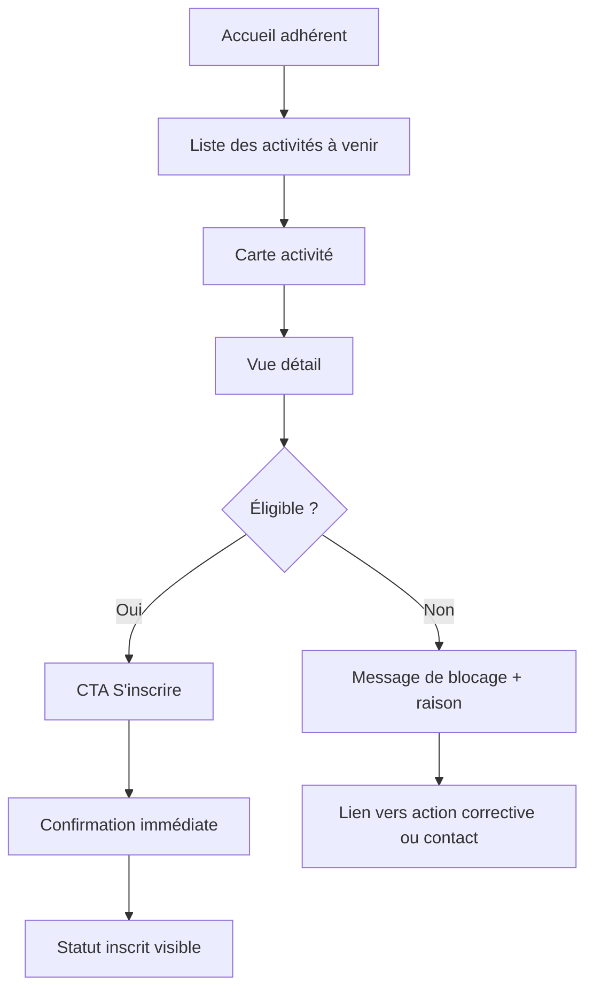
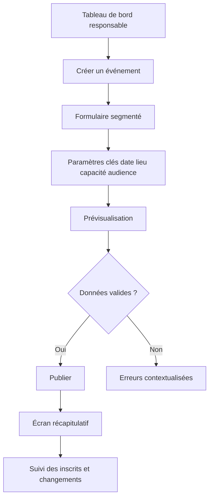
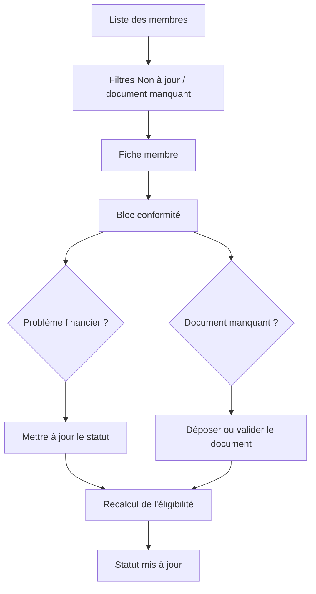
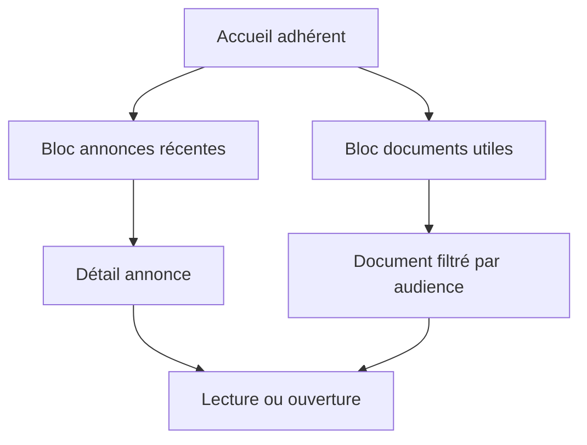

# UX Design Specification L4rs0n

**Auteur :** LUTCHANAH Kévin  
**Date :** 2026-04-08  
**Artefacts associés :**

- `ux-color-themes.html`
- `ux-design-directions.html`

## 1. Compréhension du produit

### 1.1 Synthèse produit

L4rs0n est une application web de gestion pour un club amateur de badminton en mode mono-club. Le produit remplace une constellation d'outils fragmentés par une source unique de vérité pour les membres, les événements, les créneaux, les rencontres inter-clubs, les documents et les annonces.

La valeur UX n'est pas de proposer une interface spectaculaire, mais d'éliminer le doute opérationnel. Chaque écran doit répondre rapidement à l'une de ces questions :

- Puis-je participer ?
- Que dois-je faire maintenant ?
- Qui est concerné ?
- Quelle est la dernière information fiable ?

### 1.2 Utilisateurs cibles

**Administrateurs et responsables**

- administrateur du club ;
- trésorier ou responsable budget ;
- responsable événements ;
- coach ou responsable d'activité.

Leur besoin dominant est la maîtrise. Ils veulent administrer sans ressaisie, voir les statuts importants immédiatement et éviter les erreurs de coordination.

**Adhérents**

- joueurs et membres du club ;
- utilisateurs surtout mobiles ;
- niveau de maturité numérique intermédiaire.

Leur besoin dominant est la simplicité. Ils veulent consulter, comprendre leur situation et agir en quelques secondes.

### 1.3 Objectifs UX

- Réduire la charge mentale des bénévoles sur les tâches récurrentes.
- Permettre à un adhérent de comprendre immédiatement son éligibilité.
- Donner de la visibilité sur ce qui change : publication, annulation, report, document manquant.
- Rendre l'application fiable sans paraître lourde ou administrative.
- Assurer une excellente utilisabilité mobile sur les parcours critiques.

### 1.4 Principes directeurs

- **Clarté avant densité** : on affiche d'abord l'état utile, puis le détail.
- **Statut avant action** : un utilisateur doit voir s'il peut agir avant de chercher le bouton.
- **Une source, une décision** : les règles d'éligibilité et de visibilité ne doivent pas varier selon l'écran.
- **Mobile-first pour les adhérents, desktop-friendly pour l'administration**.
- **Ton rassurant, jamais punitif** : on explique pourquoi une action est bloquée et comment débloquer la situation.

## 2. Expérience coeur

### 2.1 Expérience définissante

L'expérience signature de L4rs0n est : **"Je vois immédiatement ma situation et j'agis sans ambiguïté."**

Concrètement, cela se traduit par deux boucles majeures :

- côté adhérent : consulter une activité, comprendre son statut, s'inscrire ou se désinscrire en moins d'une minute ;
- côté responsable : publier ou ajuster une activité depuis une fiche unique avec tous les signaux critiques visibles.

### 2.2 Modèle mental utilisateur

Les utilisateurs viennent de pratiques simples :

- groupe WhatsApp ou email pour les annonces ;
- tableur ou liste partagée pour les membres ;
- agenda partagé pour les créneaux ;
- documents éparpillés dans plusieurs dossiers.

Ils s'attendent donc à :

- retrouver une logique de calendrier familière ;
- voir des listes faciles à filtrer ;
- obtenir des confirmations explicites ;
- comprendre un blocage sans jargon métier.

Ils ne s'attendent pas à apprendre un nouvel outil complexe. L'interface doit donc ressembler à un centre opérationnel clair, pas à un logiciel de gestion généraliste.

### 2.3 Critères de succès

- Un adhérent sait en moins de 5 secondes si une activité lui est accessible.
- Le bouton d'action principal est unique et visible sans scroll sur mobile.
- Un responsable comprend l'état d'un événement sans ouvrir plusieurs écrans.
- Chaque action sensible retourne un feedback immédiat, explicite et traçable.
- Les erreurs sont compréhensibles et actionnables.

### 2.4 Patterns établis vs nouveautés

L4rs0n doit majoritairement s'appuyer sur des patterns établis :

- cartes d'activité ;
- calendriers et listes filtrables ;
- badges de statut ;
- panneaux de détail ;
- formulaires segmentés ;
- toasts et bannières de confirmation.

L'innovation se situe dans la combinaison de ces patterns autour d'un **état d'éligibilité visible partout**. Le produit ne doit pas inventer de gestuelles ni de paradigmes nouveaux.

### 2.5 Mécanique de l'expérience

**Initiation**

- l'utilisateur arrive sur un tableau de bord adapté à son rôle ;
- les éléments prioritaires sont triés par immédiateté : aujourd'hui, à venir, à traiter.

**Interaction**

- chaque carte expose état, date, lieu, capacité, audience, action principale ;
- l'utilisateur peut ouvrir un panneau de détail sans perdre le contexte ;
- les responsables accèdent depuis la même surface aux actions de publication, modification ou annulation.

**Feedback**

- confirmations courtes et explicites ;
- badges de statut persistants ;
- messages d'erreur orientés solution ;
- historique visible pour les changements sensibles côté administration.

**Completion**

- l'écran reste cohérent après action ;
- le statut est mis à jour visuellement sans ambiguïté ;
- la prochaine action suggérée est affichée si nécessaire.

## 3. Réponse émotionnelle recherchée

### 3.1 Émotions cibles

- **Confiance** : les informations affichées sont à jour et fiables.
- **Soulagement** : moins de va-et-vient entre les outils.
- **Maîtrise** : les responsables sentent qu'ils contrôlent la situation.
- **Fluidité** : les adhérents n'ont pas l'impression de faire de l'administratif.
- **Appartenance** : l'interface rappelle la vie du club et pas seulement sa gestion.

### 3.2 Trajectoire émotionnelle

**Découverte**

- impression d'un espace de club propre, organisé, accueillant.

**Action principale**

- sentiment d'efficacité ;
- compréhension immédiate de l'état personnel.

**Après action**

- réassurance par confirmation et récapitulatif ;
- impression que "c'est réglé".

**En cas de blocage**

- éviter la frustration sèche ;
- expliquer la raison du blocage et la marche à suivre.

### 3.3 Micro-émotions à provoquer

- "Je sais où regarder."
- "Je comprends pourquoi c'est bloqué."
- "Je n'ai pas besoin de demander à quelqu'un."
- "Le club est bien organisé."

## 4. Inspiration et patterns de référence

### 4.1 Références UX utiles

- **Google Calendar** : lisibilité des événements, repères temporels simples, densité maîtrisée.
- **Doctolib** : clarté du statut, action principale évidente, confirmations rassurantes.
- **Notion** : hiérarchie calme, cartes sobres, usage discipliné des surfaces.
- **Decathlon / univers sport** : tonalité active, codes visuels simples, énergie sans surcharge.

### 4.2 Ce qu'il faut reprendre

- calendrier immédiatement compréhensible ;
- statut visible avant le détail ;
- fiches courtes avec information essentielle ;
- usage contrôlé de la couleur pour hiérarchiser ;
- navigation stable et répétable.

### 4.3 Ce qu'il faut éviter

- interfaces corporate trop froides ;
- tableaux surchargés sur mobile ;
- multiplication des CTA secondaires ;
- jargon administratif ;
- feedbacks invisibles ou trop techniques.

## 5. Fondation du design system

### 5.1 Choix

Le projet doit adopter un **design system thémable léger** fondé sur :

- `Tailwind CSS` pour les tokens et la vitesse d'implémentation ;
- primitives accessibles de type `shadcn/ui` / `Radix` pour les composants de base ;
- une couche de composants métier dédiée dans les features.

### 5.2 Rationale

Ce choix est le meilleur compromis pour L4rs0n :

- cohérent avec l'architecture déjà retenue ;
- assez rapide pour un MVP ;
- suffisamment personnalisable pour éviter un rendu générique ;
- robuste sur l'accessibilité et les états interactifs ;
- maintenable pour une petite équipe.

### 5.3 Approche d'implémentation

- définir des tokens sémantiques avant les composants ;
- distinguer composants transverses (`src/components`) et composants métier (`src/features/*/components`) ;
- créer les patterns métier critiques en premier : badges d'éligibilité, cartes d'activité, panneaux de conformité, timeline de créneaux.

### 5.4 Stratégie de personnalisation

- personnalisation forte au niveau couleur, typographie, rayon, ombres et densité ;
- personnalisation modérée sur les composants de base ;
- personnalisation élevée sur les surfaces métier qui portent la spécificité club.

## 6. Fondation visuelle

### 6.1 Système couleur

Direction visuelle retenue : **club sérieux, vivant, lisible**.

Palette sémantique proposée :

- `Primary / Bleu gymnase` : `#123B5D`
- `Primary strong / Bleu nuit` : `#0B2740`
- `Accent / Vert terrain` : `#1F8A70`
- `Accent soft / Vert mousse` : `#D9EEE7`
- `Surface / Sable clair` : `#F6F4EE`
- `Surface contrastée` : `#E8EDF2`
- `Texte principal` : `#15212B`
- `Texte secondaire` : `#52606D`
- `Succès` : `#1F8A52`
- `Alerte` : `#D97706`
- `Danger` : `#C0392B`
- `Info` : `#2563EB`

Règles d'usage :

- la couleur ne porte jamais seule l'information de statut ;
- les couleurs d'état sont toujours accompagnées d'icônes ou libellés ;
- le bleu structure, le vert confirme, l'orange avertit, le rouge bloque.

### 6.2 Typographie

- **Titres** : `Barlow Condensed`
- **Interface et corps** : `Source Sans 3`
- **Données ou références** : `IBM Plex Mono` en usage ponctuel

Rationale :

- `Barlow Condensed` apporte une énergie sport et signalétique ;
- `Source Sans 3` reste très lisible sur mobile et sur les tableaux administratifs ;
- `IBM Plex Mono` aide à distinguer références, ID ou horaires précis.

Échelle recommandée :

- H1 : 40/44
- H2 : 30/36
- H3 : 24/30
- H4 : 20/26
- Body large : 18/28
- Body : 16/24
- Small : 14/20
- Label : 12/16, semi-bold

### 6.3 Espacement et structure

- base d'espacement : `8px`
- densité admin : compacte respirante
- densité adhérent : plus aérée, centrée action
- rayon : `14px` cartes, `18px` panneaux importants, `999px` badges et chips
- ombres : faibles, jamais décoratives
- grille desktop : `12 colonnes`
- grille tablette : `8 colonnes`
- grille mobile : `4 colonnes`

### 6.4 Accessibilité visuelle

- contraste minimum WCAG 2.1 AA sur les parcours critiques ;
- taille cible tactile minimum `44x44px` ;
- focus visible épais et cohérent sur tous les composants interactifs ;
- textes d'aide toujours présents pour les états bloqués ou incomplets ;
- pas de texte essentiel dans une image.

## 7. Décision de direction visuelle

### 7.1 Directions explorées

Les six directions présentées dans l'artefact HTML couvrent :

1. **Tableau de bord institutionnel** : très structuré, rassurant, orienté gestion.
2. **Planning mobile-first** : action rapide, cartes, navigation basse.
3. **Magazine de club** : plus éditorial, plus chaleureux.
4. **Cockpit planning** : fort accent sur le statut et les conflits.
5. **Mur d'activités** : visuel, communautaire, plus événementiel.
6. **Minimal utilitaire** : très sobre, très efficace, peu incarné.

### 7.2 Direction retenue

La direction retenue est un **hybride entre "Planning mobile-first" et "Cockpit planning"** :

- surfaces simples et lisibles côté adhérent ;
- panneaux latéraux, filtres et vues plus denses côté responsable ;
- usage net des badges de statut ;
- sentiment général calme, fiable et actif.

### 7.3 Rationale

- meilleure compatibilité avec la dualité adhérent / administration ;
- très bon support des parcours calendrier et inscription ;
- assez de personnalité sans nuire à la maintenabilité ;
- facilite la mise en avant des règles d'éligibilité et des changements logistiques.

### 7.4 Approche d'implémentation

- une base de composants commune ;
- deux couches de composition visuelle selon la surface ;
- navigation et densité différenciées par rôle, pas par duplication du design system.

## 8. Parcours et flux clés

### 8.1 Parcours 1 : un adhérent s'inscrit à une activité

Objectif : confirmer l'éligibilité et terminer l'inscription sans friction.

Exigences UX :

- badge d'éligibilité visible dès la carte ;
- bouton principal unique ;
- raison de blocage lisible sans jargon ;
- confirmation persistante après action.

### 8.2 Parcours 2 : un responsable publie un événement

Objectif : créer puis publier un événement depuis une fiche unique.

Exigences UX :

- formulaire en sections courtes ;
- validations inline ;
- visibilité claire de l'audience ciblée ;
- prévisualisation avant publication.

### 8.3 Parcours 3 : un responsable traite un membre non conforme

Objectif : comprendre immédiatement pourquoi un membre est bloqué.

Exigences UX :

- zone conformité visible en haut de fiche ;
- séparation claire entre état, cause et action corrective ;
- journal succinct des changements sensibles.

### 8.4 Parcours 4 : un adhérent consulte les informations du club

Objectif : trouver rapidement la bonne information sans passer par la messagerie.

Exigences UX :

- classement par fraîcheur et importance ;
- recherche simple ;
- libellés de visibilité compréhensibles ;
- différenciation claire entre annonce, document et événement.

## 9. Stratégie composants

### 9.1 Composants de base attendus du design system

- boutons ;
- champs texte ;
- selects ;
- checkboxes et radios ;
- badges ;
- cartes ;
- dialogs ;
- drawers / sheets ;
- tabs ;
- table ;
- pagination ;
- toast ;
- calendrier ;
- tooltip.

### 9.2 Composants métier à créer

**Badge d'éligibilité**

- affiche l'état : à jour, en attente, bloqué ;
- inclut libellé, icône et variante couleur ;
- utilisable dans listes, fiches et cartes d'activité.

**Panneau conformité membre**

- regroupe cotisation, documents obligatoires, date de mise à jour, historique court ;
- propose les actions correctives dans le même bloc.

**Carte activité**

- format mobile-first ;
- expose date, lieu, type, capacité, statut personnel, CTA principal ;
- version compacte pour liste, version riche pour grille.

**Timeline de créneaux**

- lecture hebdomadaire ;
- états : confirmé, modifié, annulé, conflit ;
- densité adaptée au desktop.

**Panneau participants / convocations**

- filtres rapides ;
- badges de présence ;
- actions par lot pour responsables si nécessaire plus tard.

**Rail annonces et infos club**

- hiérarchie par fraîcheur et criticité ;
- différencie contenu informatif et action attendue.

### 9.3 Règles de construction

- les composants métier encapsulent le langage du club ;
- les composants transverses restent neutres ;
- les composants critiques doivent avoir états vides, loading, erreur et succès définis dès la V1.

## 10. Patterns de cohérence UX

### 10.1 Hiérarchie d'action

- un seul bouton primaire par zone de décision ;
- secondaires en style discret ;
- actions destructives séparées visuellement et toujours confirmées.

### 10.2 Feedback

- succès : toast + état persistant sur l'écran ;
- erreur : message inline près du problème + résumé si nécessaire ;
- warning : bannière contextuelle si blocage important ;
- information : badge ou note calme, jamais alarmiste.

### 10.3 Formulaires

- découpés en sections logiques ;
- labels toujours visibles ;
- aide placée avant l'erreur quand possible ;
- validation inline sur les champs critiques ;
- résumé d'erreur en tête pour mobile si formulaire long.

### 10.4 Navigation

- adhérent : navigation basse ou onglets principaux sur mobile ;
- responsable : sidebar desktop + navigation compacte mobile ;
- breadcrumb uniquement sur surfaces administratives profondes.

### 10.5 Modals et overlays

- modal courte pour confirmation ou action simple ;
- drawer / sheet pour détail sans perte de contexte ;
- page dédiée pour édition longue.

### 10.6 États vides, chargement et recherche

- les états vides expliquent ce qui manque et proposent l'étape suivante ;
- les skeletons reflètent la structure réelle du contenu ;
- recherche et filtres restent visibles sur les écrans de liste ;
- aucun écran critique ne doit afficher "0 résultat" sans aide de reformulation.

## 11. Responsive et accessibilité

### 11.1 Stratégie responsive

**Mobile (< 640px)**

- priorité aux actions fréquentes ;
- cartes verticales ;
- CTA collant si nécessaire sur l'inscription ;
- navigation basse pour adhérents.

**Tablette (640px - 1023px)**

- double colonne légère ;
- drawers pour détails ;
- densité intermédiaire.

**Desktop (>= 1024px)**

- vues de pilotage plus riches ;
- tables, filtres persistants, panneaux latéraux ;
- comparaison plus facile entre membres, événements et statuts.

### 11.2 Accessibilité fonctionnelle

- navigation clavier complète ;
- ordre de tabulation cohérent ;
- aria labels sur les actions iconiques ;
- alternatives textuelles pour les statuts ;
- zones de clic suffisamment larges ;
- gestion correcte du focus après modals et drawers.

### 11.3 Accessibilité métier

- ne jamais bloquer une inscription sans expliquer la cause ;
- rendre explicites les rôles et visibilités des documents ;
- éviter les abréviations internes du club sans explication ;
- rendre la date, le lieu et le type d'activité lisibles d'un coup d'oeil.

## 12. Hypothèses et points à valider

### 12.1 Hypothèses de travail retenues

- pas de liste d'attente sophistiquée en V1 ;
- pas de mineurs ni représentants légaux dans le MVP ;
- pas de paiement en ligne ;
- canaux de communication orientés diffusion descendante ;
- surfaces séparées adhérent / responsable, mais design system commun.

### 12.2 Décisions UX à confirmer plus tard

- niveau exact de densité du back-office ;
- place des rencontres inter-clubs dans la navigation principale ;
- besoin d'une vue calendrier mensuelle complète dès la V1 ;
- profondeur du tableau de bord administrateur ;
- icônes ou labels exacts des statuts membres.

## 13. Résumé d'exécution

La UX de L4rs0n doit donner l'impression d'un club bien organisé plutôt que d'un logiciel abstrait. La réussite du design dépend surtout de trois choses :

- rendre l'éligibilité visible partout ;
- séparer clairement les besoins adhérent et responsable ;
- maintenir une interface calme, lisible et mobile-first sur les parcours critiques.

Cette spécification est prête à guider :

- la génération de wireframes ;
- la conception de prototypes ;
- l'implémentation frontend ;
- le découpage en stories UI.
